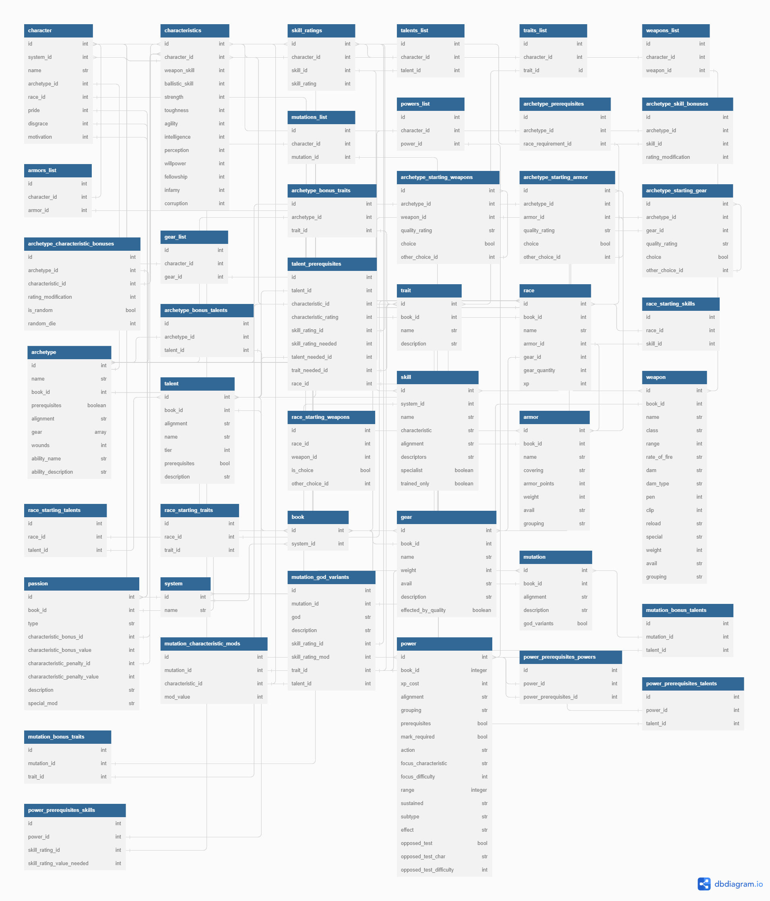

# Liber Characterum (Ruby Version)
### A Character Creator Application for Warhammer 40k TTRPGs

In the grim darkness of the 41st millenium, it's a bit annoying to try and build a new character for your tabletop games. LC is here to try and make that a bit easier.

## Supported Systems
- [ ] Black Crusade
    - [ ] Core Rulebook
    - [ ] Tome of Blood
    - [ ] Tome of Decay
    - [ ] Tome of Excess
    - [ ] Tome of Fate
- [ ] Only War
- [ ] Deathwatch
- [ ] Rogue Trader
- [ ] Dark Heresy

## To Do List

- [X] Set up Github Repo
- [ ] Create basic database
    - [ ] Allow for custom database entries
- [ ] Create Interface with Tk
  - [ ] Base Wireframes
  - [ ] Database Interaction
- [ ] Configure Character Creation Interface
- [ ] Allow character saving as a database file
    - [ ] Character Exporting as .pdf

## Features
### Essential
- Create a character via gui interface
- Save character to the database
- Update character
- Export character as a printable PDF

### Non-Essential
- Stat trackers for use during play
- Togglable combat status modifiers
- Archiving characters
- Dice Roller with automated DoS/DoF calculation
- Daemon Weapon/Armor Creation
- Create custom database entries
- NPC Maker
- Ability to have multiple characters open and swap between them
- create .exe file for easy startup

## Do Know
- Database creation with sqlite or postgresql. Maybe MongoDB?
- How to play Black Crusade (sorta)

## Don't Know
- Creating GUI
- Exporting data from database as pdf

## Libraries needed
- GUI
    - Tkinter
- Database interfacing
- PDF exporting

## DB Tables
- Characters
- Systems
- Archetypes
- Gear
    - Divide into multiple tables for each category?
- Armor
- Weapons
- Characteristics
- Races
- Skills
- Traits
- Talents
- Passions
- Mutations
- Psychic Powers

### BEHOLD! THE DATABASE SCHEMA!
